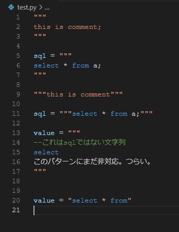

# python comment sql syntax

I just want to do this.


多くのエクステンションでそれが実装されていない理由は、
<https://macromates.com/manual/en/language_grammars>より、

> 正規表現は、一度にドキュメントの 1 行に対してのみ照合されることに注意してください。
> つまり、複数の行に一致するパターンを使用することはできません。
> この理由は技術的なものです。任意の行でパーサーを再起動でき、
> 編集の影響を受ける最小限の数の行のみを再解析する必要があります。
> ほとんどの場合、begin/end モデルを使用してこの制限を克服することができます。

この制約があるから。


頑張ってこれを解決する策を探す。

## 現在の状況

以下には対応できない。

```python

value = """
こういった書式の文字列。
"""

```

たまに使う。

```python

value = """
select * from a;
"""

```

これと同じくらいの頻度で。


# 所感

そもそも文字列中にsql書くなって話なんだろうな。